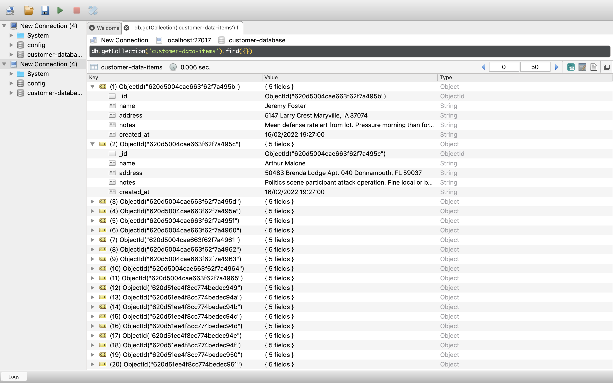
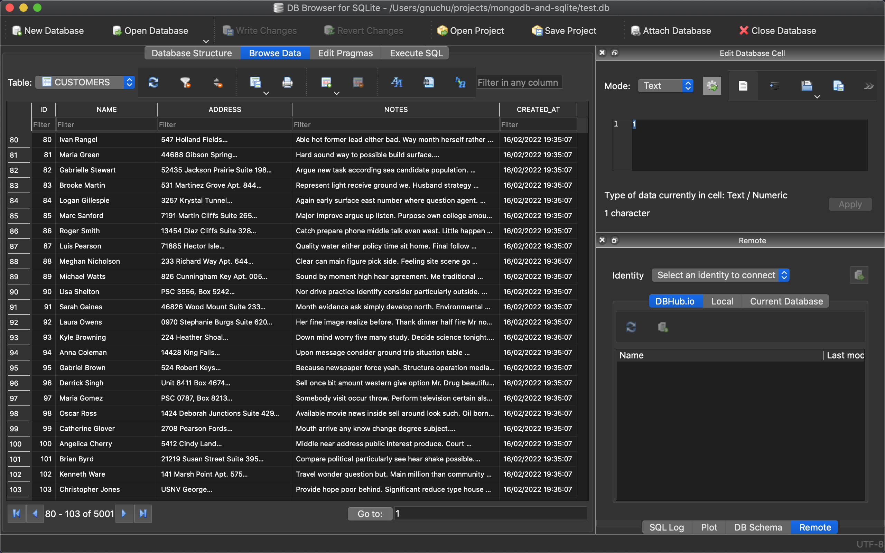

# Requirements

### Homebrew

If its not already installed follw the instructions at:

> https://brew.sh/

### MongoDB and Sqlite

> * brew tap mongodb/brew
> * brew install mongodb/brew/mongodb-community mongodb/brew/mongodb-community-shellbrew install
>
> * brew services start mongodb/brew/mongodb-community
> * brew install robo-3t (optional - install neat front end for mongo that makes viewing data easier)

Type

> sqlite3 -version

at the command prompt. You should get some output like:

> sqlite3 -version
> 3.37.2 2022-01-06 13:25:41 872ba256cbf61d9290b571c0e6d82a20c224ca3ad82971edc46b29818d5d17a0

If you get this (version number not important as long as it is greater than 3.0) than nothing else is required. If you get an error then:

> brew install sqlite3

### Python packages

(Assuming you have a working python install)

> pip install -r requirements.txt

### Process

* Run seed_mongo_db.py
  * This should give you records in your MongDB
    * 
* Run read_and_convert.py
  * This should give you records in your sql DB (test.db)

    
